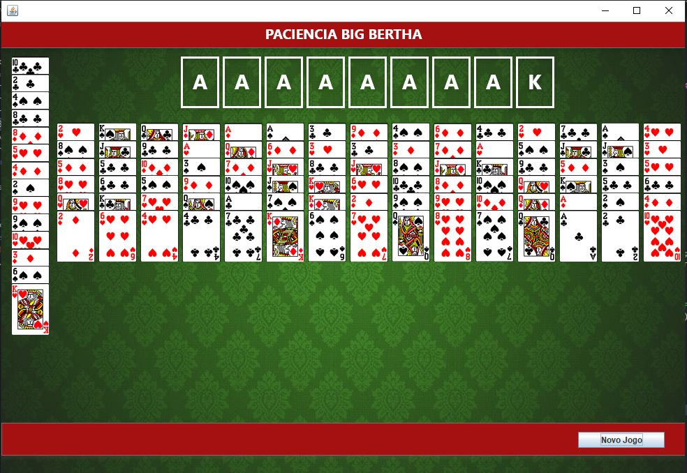

# Paciência Big Bertha
Implementação do jogo paciência Big Bertha feita em Java utilizando swing.

## O jogo

A distribuição do jogo é a seguinte:
1. Dois baralhos de 52 cartas são utilizados.
2. Existem 9 fundações ao todo. Existem 8 fundações por pilhas de naipes que são
inicialmente vazias. Existe 1 fundação, que só aceita os reis.
3. Existem 15 pilhas de fileiras, com todas as cartas viradas para cima. Todas contém 6
cartas.
4. Existe 1 pilha de estoque, onde as cartas restantes ficam abertas. Todas as cartas da pilha
de estoque estão disponíveis para serem movidas para as fundações ou fileiras
5. Os naipes são Espadas, Copas, Paus, e Ouros.

## Regras de movimentação de cartas

1. As fundações devem começar com um Ás e seguindo por ordem ascendente (por exemplo :
A, 2, 3, 4, 5, 6, 7, 8, 9, 10, J, Q, K de Copas, de baixo para cima)
2. Qualquer carta ou pilha de fileira pode ser movida para uma pilha de fileira, se a mesma
estiver vazia. Caso não esteja vazia, as pilhas de fileiras devem alternar de preto e vermelho, e devem ser construídas sob
pontuação descendente. Portanto, você pode colocar tanto um 4 de Copas ou um 4 de Ouros
em um 5 Paus, mas não um 4 de Paus ou 4 de Espadas.
3. Não é permitido retornar a carta de
topo das fundações para as fileiras.

### Como jogar o jogo:

1. Clone o projeto
2. Entre na pasta /out
3. Abra com o terminal (cmd) nesta pasta e digite `java -jar launcher.jar`
